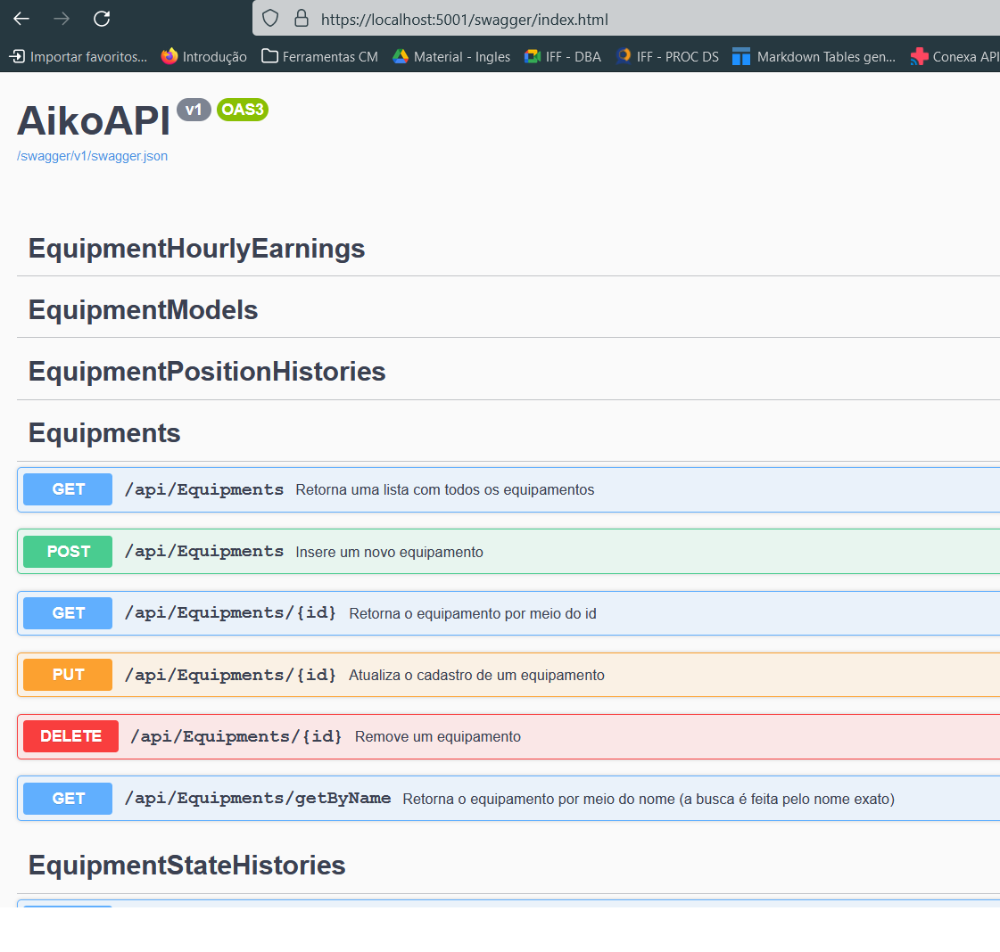
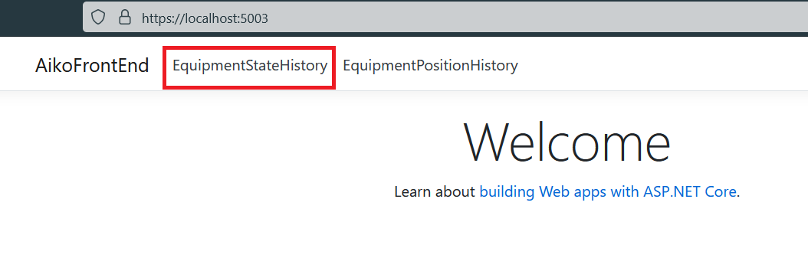
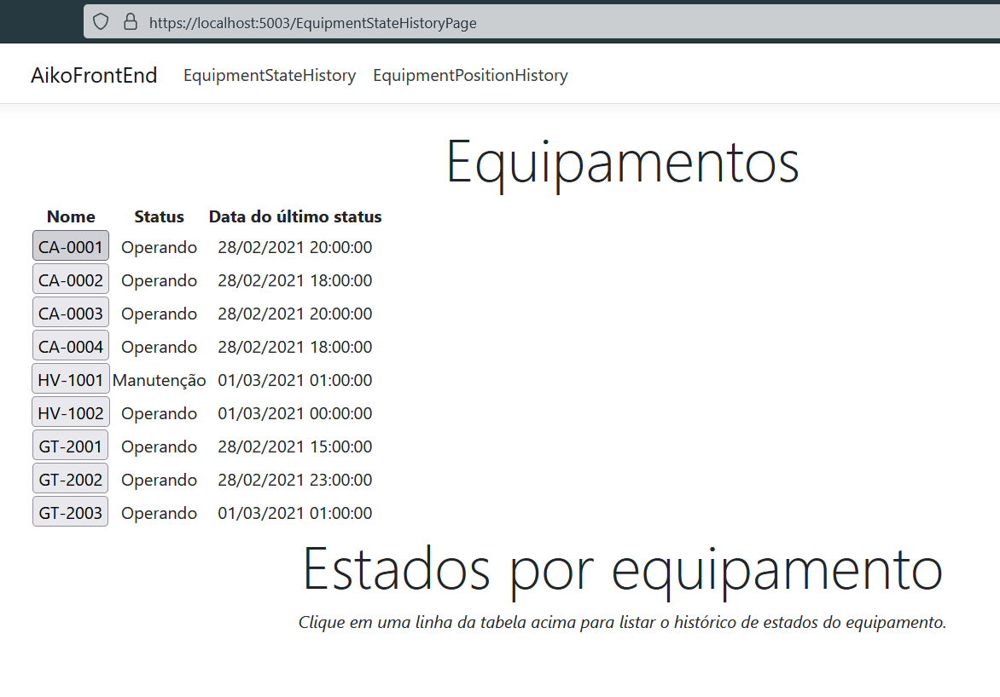
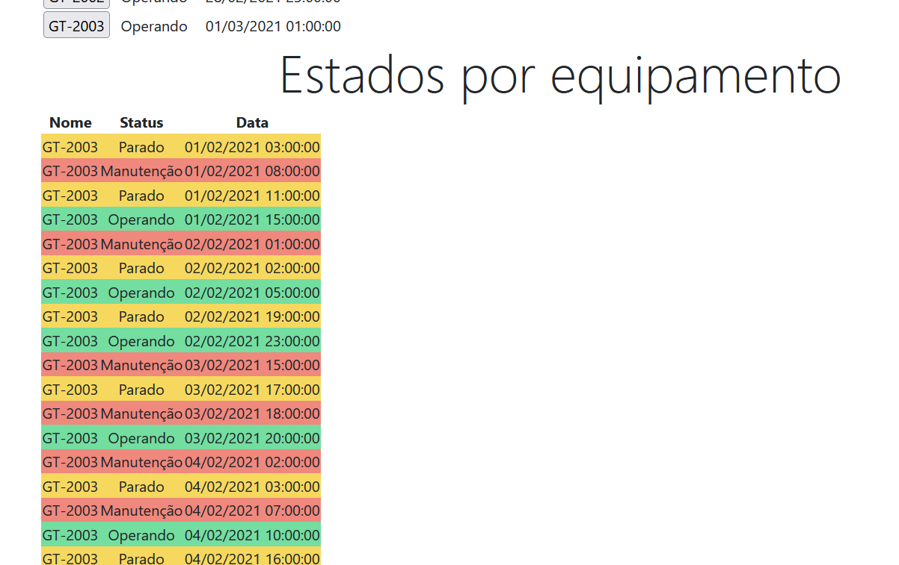
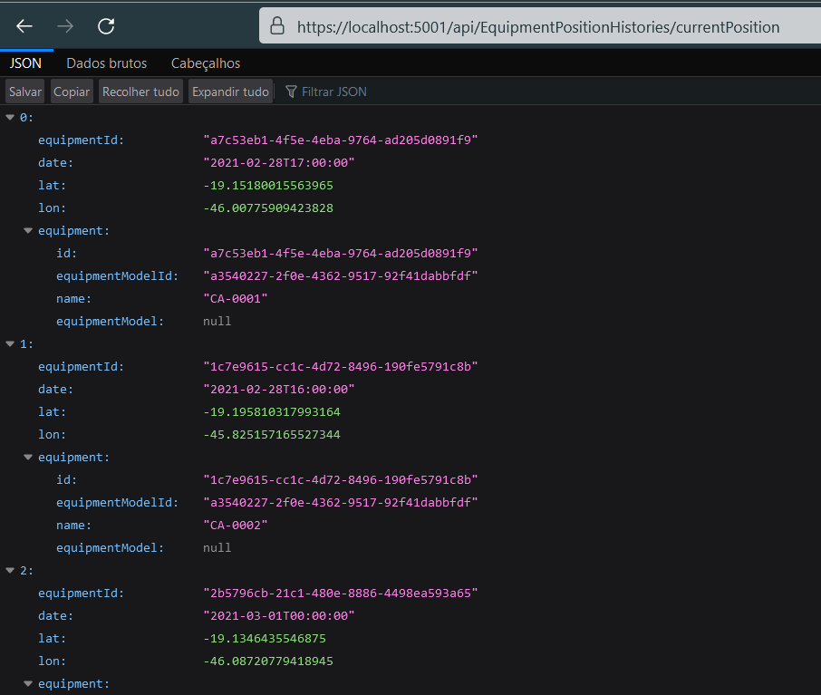
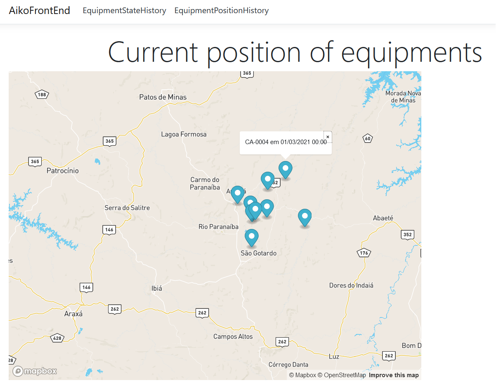

# Teste Backend - Leonardo Coutinho

Atendendo aos requisitos do teste implementei a API para as classes que foram propostas no backup do banco de dados disponibilizado. No projeto AikoAPI criei a pasta Models e uma classe para cada tabela no banco de dados. Nos modelos usei as data annotations do Entity Framework para o mapeamento das propriedades em colunas das tabelas. Para criação dos controllers que expõem os endpoints utilizei o scaffold do Visual Studio 2019 e fiz as alteraçãoes necessárias como por exemplo os endpoints que buscam pelo nome ou que utilizam id e data.

Fiz a documentação da API no swagger utilizando os comentários como é explicado neste [artigo](https://docs.microsoft.com/pt-br/aspnet/core/tutorials/getting-started-with-swashbuckle?view=aspnetcore-6.0&tabs=visual-studio) da Microsoft. 

Para iniciar o banco de dados basta abrir um terminal no VSCode no diretorio raiz do projeto (teste-backend-v2) e digitar os seguintes comandos.
```
docker-compose up -d
docker exec -it teste-backend-v2_db_1 bash
psql -U postgres -c 'CREATE DATABASE aikodb;'
pg_restore -U postgres -d aikodb -1 /var/lib/postgres/data
exit
```
Deixei comentado no docker-compose a parte que criei por meio do assistente do plugin do Docker no VSCode para a conteinerização da API e do FrontEnd mas por um motivo que não consegui corrigir o redirecionamento das portas http e https não estava funcionando corretamente.

Para iniciar as aplicações no local é necessário acessar cada pasta (AikoAPI e AikoFrontEnd) em um terminal e rodar os comandos:
```
dotnet restore
dotnet run
```

A API é disponibilizada no caminho https://localhost:5001, a documentação do Swagger pode ser acessada em https://localhost:5001/swagger.index.html.


A página pode ser visualizada em https://localhost:5003, abaixo uma explicação das telas disponíveis:
A primeira página é o relatório de status dos equipamentos. Existe uma lista com o estado atual de todos os equipamentos, cada linha possui um botão para acessar o histórico completo de estados daquele equipamento.




A segunda página apresenta um mapa criado com a biblioteca [Leaflet](https://leafletjs.com/) utilizando uma mapa disponibilizado pela [mapbox](https://www.mapbox.com/), essa página consome os dados do endpoint https://localhost:5001/api/EquipmentPositionHistories/currentPosition, ao clicar em um marker é exibido o nome do equipamento e a data em que aquela posição foi computada.




